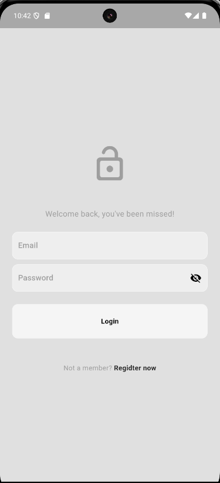
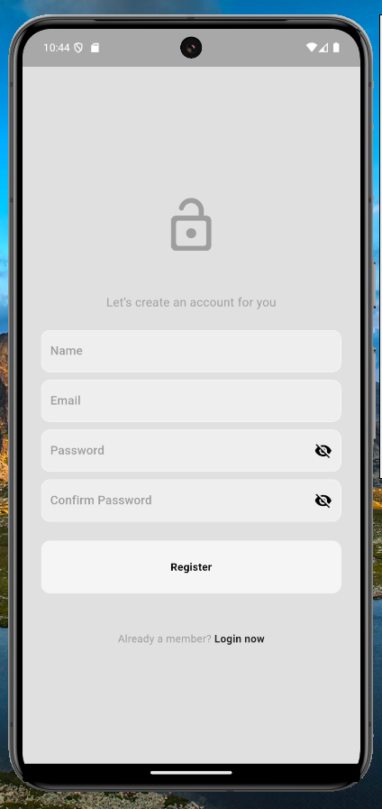

# 📱 Social Media App - Flutter
Este é um aplicativo de mídia social desenvolvido em Flutter que permite aos usuários criar contas, fazer postagens, curtir e comentar em postagens de amigos, seguir amigos, editar perfil e personalizar o tema do aplicativo (claro ou escuro). O projeto utiliza a arquitetura BloC/Cubit para gerenciar o estado e Firebase para autenticação e armazenamento de dados.

## 🌟 Funcionalidades
* 🔑 Cadastro e Login de Usuário: Crie sua conta e faça login no aplicativo.
    * 📝 Postagens:
    * ➕ Criar novos posts.
    * 🗑️ Deletar seus próprios posts.
    * ❤️ Curtir posts de amigos.
    * 💬 Comentar em posts de amigos.
    * ❌ Deletar seus próprios comentários.
* 👥 Amigos:
    * ➕ Seguir outros usuários.
    * 🔔 Ser seguido por outros usuários.
* 👤 Perfil:
    * ✏️ Editar informações do perfil, incluindo foto e biografia.
    * 📋 Exibir lista de seguidores e seguidos.
* 🎨 Tema:
    * 🌞/🌙 Alterne entre tema claro e escuro.
* 📲 Gerenciamento de Estado:
  * Utiliza BloC/Cubit para controle eficiente do estado.
## 🛠️ Tecnologias Utilizadas
* 🖥️ Flutter
* 🛠️ Dart
* 🔥 Firebase:
  * Firebase Authentication: Para gerenciamento de usuários (login/cadastro).
  * Cloud Firestore: Para armazenamento de dados em tempo real.
  * Firebase Storage: Para armazenamento de fotos de perfil e imagens de postagens.
* 🎯 BloC/Cubit: Para gerenciamento de estado.
* 🔌 Provider: Para injeção de dependências.
## 📸 Screenshots do Projeto
### 🔑 Autenticação
<!doctype html>
<html lang="en">
  <head>
    <meta charset="utf-8">
    <meta name="viewport" content="width=device-width, initial-scale=1">
    <title>Bootstrap demo</title>
    <link href="https://cdn.jsdelivr.net/npm/bootstrap@5.3.3/dist/css/bootstrap.min.css" rel="stylesheet" integrity="sha384-QWTKZyjpPEjISv5WaRU9OFeRpok6YctnYmDr5pNlyT2bRjXh0JMhjY6hW+ALEwIH" crossorigin="anonymous">
  </head>
  <body>
   

   

      <h4>Tela de Login</h4>
  
   <h4>Tela de Registro</h4>
  
   

    
  </body>
</html>
Tela de Login
Tela de Registro
### 🏠 Home
 

Feed de Postagens
Drawer de Navegação
### 📝 Postagens
 

Criar Nova Postagem
Detalhes de Postagem com Comentários
### 👤 Perfil
 

Tela de Perfil do Usuário
Edição de Perfil
### 🔍 Busca

Tela de Busca de Usuários
### ⚙️ Configurações

Tela de Configurações (Tema Claro/Escuro)
